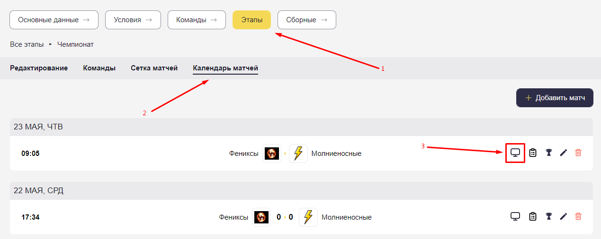

# Инструкция по подключению оверлея к OBS.

Желательно все настройки сделать до начала эфира.

1. Получить ссылку
    1. Необходимо на сайте перейти в настройки турнира.
    2. Далее выбираем "**Этапы**" → "**Календарь матчей**" → **🖥️**

        

    3. Нажать кнопку "**Получить ссылку на оверлей**" на открытой вкладке.

        

    4. Теперь в буфере обмена сохранена ссылка на оверлей для текущего матча, она нам понадобиться позднее.
2. Далее переходим в OBS.
3. Добавить источник "**Браузер**".

    

    

4. В появившемся окне:
    1. Выбираем **"Создать новый"**.
    2. Называем как удобно, например - **"23 мая | ФСК vs ФК ФОРСАЖ"**.
    3. И жмём **"Хорошо"**.
5. Далее открывается окно свойств текущего источника.
    1. В поле "**URL-адрес**" вставляем полученную ранее ссылку на оверлей.
    2. Выставляем ширину и высоту, как у окна трансляции.
        1. Размеры трансляции можно посмотреть перейдя в "**Файл**" → "**Настройки**" → "**Видео**" → "**Базовое разрешение (холст)**". Первое ширина, далее через ***x*** высота.

            

            

            

    3. Далее к ширине необходимо добавить 300. (т.к. ширина панели управления ровна 300, нам необходимо его будет убрать за экран и при растягивании источника сам оверлей не должен исказиться).
    4. Остальные настройки можно оставить стандартными и нажимаем "**Хорошо**".
6. На сцене должен отобразиться красный прямоугольник (*в первый раз будет окно с входом на сайт*), с частью находящейся за границей (если размер не такой, как на экране, ничего страшного). Так и должно быть.

    

7. Закрепляем. Красная рамка должна пропасть.

    

8. Для получения доступа к панели управления, необходимо:
    1. Выбрать созданный источник, к примеру, "**23 мая | ФСК vs ФК ФОРСАЖ**" нажав на него в списке.
    2. Нажать "Взаимодействовать".

        

    3. Далее пользуемся как обычным сайтом.
    4. Авторизуемся.
    5. После успешной аутентификации, перекинет на пустой экран.

        > В случае когда перекидывает на сайт, а не на пустой экран, необходимо в свойствах источника в поле "**URL-адрес**" в конце добавить пробел и сохранить.

        Для этого закрываем все открытые окна, выбираем созданный источник кликнув на него, над ним нажимаем кнопку "Свойсво" с значком шестерёнки.
        >
9. Если окно не растянулось как на картинке (пункт 6), то это необходимо сделать самостоятельно, растянув так, что бы пустое пространство занимало всю видимую часть, а сама панель управления была скрыта за экраном, как на картинке.
10. Оверлей уже функционирует и при отправке событий с телефона уже будут появляться элементы интерфейса на экране.
11. Что бы открыть панель управления, необходимо:
    1. Открыть созданный источник для взаимодействия, как на шаге 7.
    2. Появившееся окно необходимо растянуть на весь экран, на сколько это возможно.
    3. Окно можно передвинуть вбок (как показана на видео), убрав пустую часть за экран, оставив только панель управления.

<video controls style="max-width: 100%; height: auto;">
  <source src="_media/streams/showOBS.mp4" type="video/mp4">
  Ваш браузер не поддерживает видео HTML5.
</video>

?> Панель управление функционирует и готова работать.
